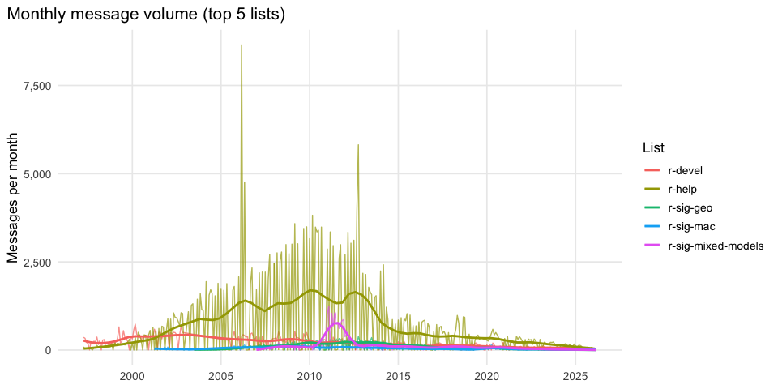
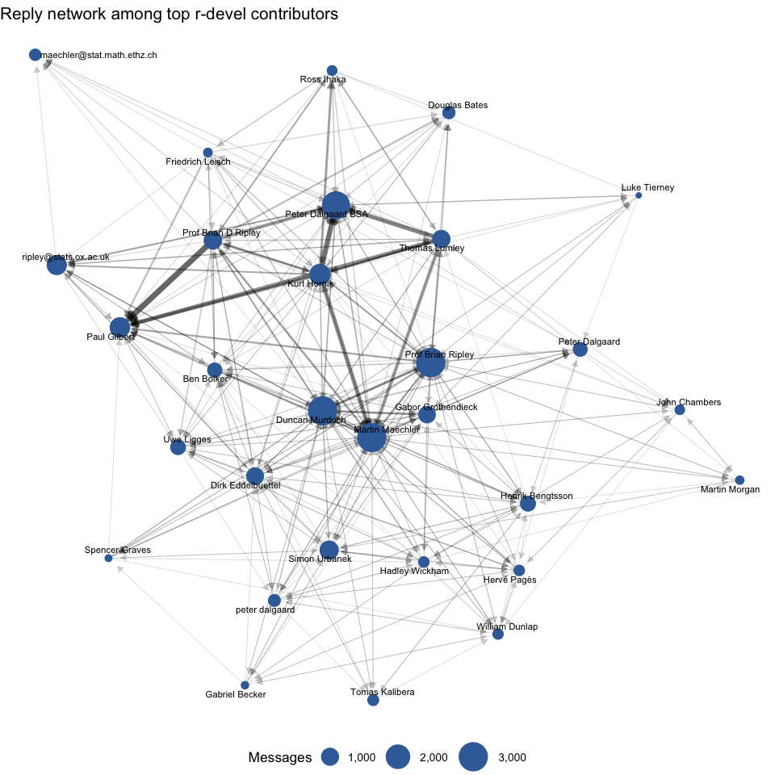

# R Mailing List Data


A collection of [R mailing list](https://www.r-project.org/mail.html)
archives in [Parquet](https://parquet.apache.org/) format, ready for
analysis in R, Python, or any language with Parquet support.

Data is sourced from the [R Mailing Lists archive
project](https://github.com/r-mailing-lists) and updated automatically.
You can also browse the archives at
[r-mailing-lists.thecoatlessprofessor.com](https://r-mailing-lists.thecoatlessprofessor.com).

## Quick start

### R

``` r
library(nanoparquet)

# Read a single list
r_devel <- read_parquet("data/messages/r-devel.parquet")

# Read specific columns (skips body text for faster loading)
r_devel_meta <- read_parquet(
  "data/messages/r-devel.parquet",
  col_select = c("list", "from_name", "date", "subject", "thread_id", "month")
)

# Read all lists into one data frame
files <- list.files("data/messages", pattern = "\\.parquet$", full.names = TRUE)
all_msgs <- do.call(rbind, lapply(files, read_parquet))
```

### Python

``` python
import polars as pl

# Read a single list
r_devel = pl.read_parquet("data/messages/r-devel.parquet")

# Read all lists
all_msgs = pl.read_parquet("data/messages/*.parquet")

# Top posters in 2024
(all_msgs
  .filter(pl.col("list") == "r-devel", pl.col("date") >= "2024-01-01")
  .group_by("from_name")
  .len()
  .sort("len", descending=True)
  .head(10))
```

## Data overview

**417,376** messages across **25** mailing lists

| List                 | Messages | Authors | First Message | Last Message |
|:---------------------|:---------|:--------|:--------------|:-------------|
| r-help               | 230,602  | 25,897  | Apr 1997      | Feb 2026     |
| r-devel              | 62,188   | 4,923   | Apr 1997      | Mar 2026     |
| r-sig-mixed-models   | 27,561   | 3,096   | Jan 2007      | Mar 2026     |
| r-sig-geo            | 25,472   | 3,450   | Jul 2003      | Mar 2026     |
| r-sig-mac            | 13,354   | 1,729   | Jan 1970      | Mar 2026     |
| r-sig-finance        | 13,150   | 2,083   | Jun 2005      | Feb 2026     |
| r-package-devel      | 11,733   | 1,147   | May 2015      | Mar 2026     |
| r-sig-ecology        | 7,393    | 1,419   | Apr 2008      | Mar 2026     |
| rcpp-devel           | 5,912    | 579     | Dec 2009      | Jan 2026     |
| r-sig-meta-analysis  | 5,028    | 540     | Jun 2017      | Mar 2026     |
| r-sig-debian         | 3,559    | 522     | Jul 2005      | Dec 2025     |
| r-sig-hpc            | 2,149    | 403     | Oct 2008      | Dec 2024     |
| r-packages           | 1,836    | 605     | Sep 2003      | Jan 2026     |
| r-sig-db             | 1,556    | 402     | Apr 2001      | Nov 2020     |
| r-sig-fedora         | 917      | 136     | May 2008      | Sep 2025     |
| r-sig-gui            | 870      | 242     | Oct 2002      | Feb 2018     |
| r-sig-teaching       | 847      | 236     | Oct 2006      | Jan 2026     |
| r-announce           | 700      | 120     | Apr 1997      | Feb 2026     |
| r-sig-dynamic-models | 697      | 164     | Oct 2009      | Feb 2026     |
| r-sig-epi            | 574      | 172     | Nov 2005      | Mar 2026     |
| r-sig-robust         | 524      | 159     | Nov 2005      | Dec 2025     |
| r-sig-jobs           | 434      | 271     | Feb 2007      | Feb 2024     |
| r-sig-gr             | 176      | 83      | Sep 2002      | Nov 2025     |
| r-sig-insurance      | 117      | 40      | Apr 2009      | Dec 2022     |
| r-sig-networks       | 27       | 21      | Jul 2008      | May 2019     |

<div id="fig-timeline">



Figure 1

</div>

## Example: Reply network on r-devel

The `in_reply_to` field links each message to its parent, making it
straightforward to build a “who replies to whom” network.

<div id="fig-reply-network">



Figure 2

</div>

## Data dictionary

### `data/messages/<list>.parquet`

One Parquet file per mailing list. All files share the same schema.

| Column | Type | Description |
|----|----|----|
| `list` | string | Mailing list name (e.g., `r-devel`) |
| `id` | string | Unique message ID (`msg-<hash>`) |
| `message_id` | string | Original RFC 2822 Message-ID header |
| `from_name` | string | Author display name |
| `from_email_hash` | string | SHA-256 hash of author email (privacy-preserving) |
| `date` | timestamp | Message date (UTC) |
| `subject` | string | Subject line with `Re:`/`Fwd:` prefixes stripped |
| `in_reply_to` | string | ID of the parent message (null for thread starters) |
| `body` | string | Full message body text |
| `body_snippet` | string | First 200 characters of the body |
| `thread_id` | string | Thread grouping ID (`thread-<hash>`) |
| `thread_depth` | integer | Depth in thread tree (0 = root message) |
| `month` | string | `YYYY-MM` for temporal bucketing |

### `data/threads.parquet`

Thread-level summaries for all lists.

| Column            | Type      | Description                       |
|-------------------|-----------|-----------------------------------|
| `list`            | string    | Mailing list name                 |
| `id`              | string    | Thread ID (`thread-<hash>`)       |
| `subject`         | string    | Thread subject                    |
| `message_count`   | integer   | Number of messages in thread      |
| `started`         | timestamp | Date of first message             |
| `last_reply`      | timestamp | Date of most recent reply         |
| `root_message_id` | string    | ID of the thread-starting message |

### `data/contributors.parquet`

Aggregated contributor statistics across all lists.

| Column          | Type    | Description                        |
|-----------------|---------|------------------------------------|
| `name`          | string  | Author display name                |
| `message_count` | integer | Total messages across all lists    |
| `list_count`    | integer | Number of distinct lists posted to |
| `lists`         | string  | Comma-separated list names         |

## Privacy

Email addresses are not included in this dataset. Author identity is
represented by display name and a SHA-256 hash of the email address,
which allows grouping messages by author without exposing contact
information. The original emails are publicly archived on the source
mailing list servers.

## License

The mailing list content is publicly archived by the [R
Project](https://www.r-project.org/mail.html) via [ETH
Zurich](https://stat.ethz.ch/pipermail/) and
[R-Forge](https://lists.r-forge.r-project.org/pipermail/). This dataset
reformats that public content for easier analysis. The tooling in this
repository is licensed under the [MIT License](LICENSE).
