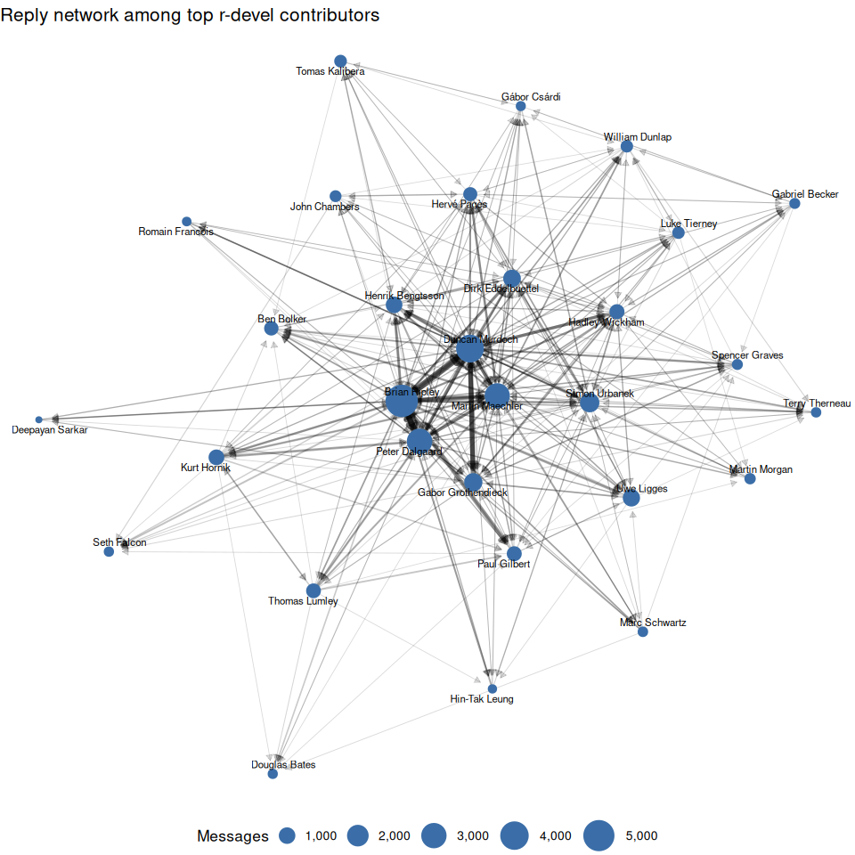

# R Mailing List Data


A collection of [R mailing list](https://www.r-project.org/mail.html)
archives in [Parquet](https://parquet.apache.org/) format, ready for
analysis in R, Python, or any language with Parquet support.

Data is sourced from the [R Mailing Lists archive
project](https://github.com/r-mailing-lists) and updated automatically.
You can also browse the archives at
[r-mailing-lists.thecoatlessprofessor.com](https://r-mailing-lists.thecoatlessprofessor.com).

## Quick start

### R

Requires [`jsonlite`](https://cran.r-project.org/package=jsonlite) and
[`nanoparquet`](https://cran.r-project.org/package=nanoparquet). Source
the helper script directly from GitHub:

``` r
source("https://raw.githubusercontent.com/r-mailing-lists/data/main/scripts/rml.R")
```

``` r
# See available lists
rml_available()

# Read only metadata columns (skips body text — much faster)
r_devel <- rml_read("r-devel",
  col_select = c("from_name", "date", "subject", "thread_id", "month"))

# Top 10 posters in the last year
recent <- r_devel[r_devel$date >= as.POSIXct(Sys.Date() - 365), ]
head(sort(table(recent$from_name), decreasing = TRUE), 10)

# Message counts per list (thread summaries — single small download)
threads <- rml_read_threads(col_select = c("list", "message_count"))
aggregate(message_count ~ list, data = threads, FUN = sum)

# Top contributors across all lists
contribs <- rml_read_contributors()
head(contribs[order(-contribs$message_count), ], 10)
```

### Python

Requires [`polars`](https://pola.rs/). Download the helper script:

``` bash
curl -O https://raw.githubusercontent.com/r-mailing-lists/data/main/scripts/rml.py
```

``` python
from rml import rml_available, rml_read, rml_read_threads, rml_read_contributors
import polars as pl

# See available lists
rml_available()

# Read a single list (downloads and caches parquet files automatically)
r_devel = rml_read("r-devel")

# Top 10 posters in 2025
(r_devel
   .filter(pl.col("date").dt.year() == 2025)
   .group_by("from_name")
   .len()
   .sort("len", descending=True)
   .head(10))

# Message counts per list (thread summaries — single small download)
(rml_read_threads()
   .group_by("list")
   .agg(pl.col("message_count").sum())
   .sort("message_count", descending=True))

# Top contributors across all lists
(rml_read_contributors()
   .sort("message_count", descending=True)
   .head(20))
```

### Working with a local clone

If you prefer working with local files, clone the repo and read parquet
files directly:

``` r
# R
library(nanoparquet)
r_devel <- read_parquet("data/messages/r-devel.parquet")
```

``` python
# Python
import polars as pl
r_devel = pl.read_parquet("data/messages/r-devel.parquet")
all_msgs = pl.read_parquet("data/messages/*.parquet")
```

For more in-depth analysis examples (message volume trends, top
contributors), see the [demo analysis](analysis/demo-analysis.md).

## Data overview

**645,815** messages across **112** mailing lists

| List                    | Messages | Authors | First Message | Last Message |
|:------------------------|:---------|:--------|:--------------|:-------------|
| r-help                  | 398,780  | 37,118  | Apr 1997      | Oct 2026     |
| r-devel                 | 63,720   | 5,862   | Apr 1997      | Oct 2026     |
| r-sig-geo               | 29,587   | 3,501   | Jul 2003      | Sep 2026     |
| bioc-devel              | 21,521   | 1,705   | Mar 2004      | Oct 2026     |
| r-sig-mixed-models      | 20,669   | 3,114   | Jan 2007      | Sep 2026     |
| r-help-es               | 15,407   | 899     | Mar 2009      | Sep 2026     |
| r-sig-finance           | 15,315   | 2,164   | Jun 2004      | Sep 2026     |
| r-sig-mac               | 15,116   | 1,725   | Jan 1970      | Oct 2026     |
| r-package-devel         | 12,396   | 1,130   | May 2015      | Oct 2026     |
| rcpp-devel              | 11,011   | 801     | Nov 2009      | May 2026     |
| r-sig-ecology           | 7,589    | 1,329   | Apr 2008      | Oct 2026     |
| r-sig-meta-analysis     | 5,647    | 551     | Jun 2017      | Sep 2026     |
| r-sig-debian            | 3,677    | 504     | Feb 2005      | Sep 2026     |
| datatable-help          | 3,415    | 441     | Mar 2010      | Apr 2018     |
| r-sig-hpc               | 2,152    | 383     | Oct 2008      | Dec 2024     |
| adegenet-forum          | 1,994    | 454     | Feb 2008      | Feb 2025     |
| r-sig-db                | 1,559    | 391     | Apr 2001      | Nov 2020     |
| genabel-devel           | 1,350    | 65      | Nov 2010      | Dec 2018     |
| r-packages              | 1,346    | 570     | Sep 2003      | Sep 2026     |
| r-sig-gui               | 1,236    | 264     | Oct 2002      | Feb 2018     |
| r-sig-fedora            | 931      | 129     | May 2008      | Apr 2026     |
| r-sig-teaching          | 886      | 224     | Oct 2006      | Sep 2026     |
| phylobase-devl          | 724      | 28      | Feb 2008      | Apr 2014     |
| r-announce              | 714      | 112     | Apr 1997      | Sep 2026     |
| r-sig-dynamic-models    | 697      | 160     | Oct 2009      | Mar 2026     |
| r-sig-epi               | 665      | 166     | Nov 2005      | Oct 2026     |
| r-sig-genetics          | 580      | 61      | May 2008      | Oct 2026     |
| flr-list                | 539      | 49      | Oct 2011      | Apr 2019     |
| r-sig-robust            | 525      | 152     | Nov 2005      | Jul 2026     |
| roxygen-devel           | 469      | 59      | May 2008      | Aug 2015     |
| r-sig-jobs              | 442      | 267     | Feb 2007      | Mar 2026     |
| traminer-users          | 383      | 96      | May 2010      | Jul 2023     |
| rsiena-help             | 354      | 67      | Feb 2010      | May 2019     |
| qtinterfaces-devel      | 349      | 22      | Sep 2009      | May 2014     |
| sorvi-admin             | 300      | 28      | Nov 2011      | Nov 2021     |
| seqinr-forum            | 296      | 58      | Jul 2008      | Mar 2023     |
| gsoc-porta              | 273      | 8       | Jun 2013      | Aug 2014     |
| tikzdevice-bugs         | 268      | 48      | Jul 2009      | Nov 2013     |
| rprotobuf-yada          | 237      | 13      | Oct 2009      | Oct 2016     |
| basta-users             | 199      | 49      | Nov 2011      | Nov 2025     |
| rnomads-user            | 198      | 40      | Sep 2014      | Apr 2023     |
| r-ug-ottawa             | 197      | 66      | Jan 2009      | Dec 2022     |
| r-sig-gr                | 177      | 79      | Sep 2002      | Sep 2026     |
| mediation-information   | 158      | 31      | May 2011      | Jan 2021     |
| r-sig-windows           | 146      | 21      | Aug 2015      | Sep 2026     |
| inlinedocs-support      | 137      | 60      | Nov 2009      | Jun 2014     |
| rcppoctave-user         | 133      | 8       | Oct 2013      | Nov 2016     |
| r-sig-insurance         | 117      | 39      | Apr 2009      | Dec 2022     |
| nmof-news               | 115      | 1       | Jun 2011      | Oct 2025     |
| rspatial-devel          | 107      | 10      | Apr 2011      | Dec 2015     |
| tlocoh-info             | 105      | 34      | Sep 2013      | May 2021     |
| rquantlib-devel         | 75       | 15      | Feb 2010      | Feb 2017     |
| ipmpack-users           | 69       | 35      | Aug 2012      | May 2019     |
| genoplotr-help          | 67       | 12      | Jun 2010      | Nov 2020     |
| r-sig-dcm               | 67       | 17      | Jul 2010      | Sep 2024     |
| nmf-user                | 61       | 17      | Nov 2011      | Jul 2020     |
| reddyproc-users         | 51       | 14      | Jul 2013      | Nov 2019     |
| rcicr-users             | 48       | 12      | Oct 2014      | Mar 2019     |
| boostheaders-devel      | 37       | 7       | Feb 2013      | Jan 2015     |
| remoterengine-devel     | 35       | 2       | Aug 2009      | Oct 2009     |
| monetr-users            | 34       | 6       | Jul 2013      | Nov 2015     |
| pomp-announce           | 32       | 1       | May 2010      | Jul 2015     |
| listpackage-discuss     | 27       | 10      | May 2011      | Mar 2017     |
| r-sig-networks          | 27       | 21      | Jul 2008      | May 2019     |
| expm-developers         | 26       | 9       | Feb 2009      | Mar 2025     |
| hyperspec-help          | 21       | 8       | Dec 2009      | Jul 2017     |
| gsoc-dowd               | 19       | 3       | Jun 2015      | Sep 2015     |
| genabel-announce        | 16       | 2       | Aug 2013      | Dec 2018     |
| batman-users            | 15       | 7       | Mar 2013      | Jun 2015     |
| forensim-help           | 15       | 8       | Nov 2011      | Jul 2015     |
| r-marketing-bugs        | 14       | 6       | Feb 2015      | Oct 2020     |
| picante-devel           | 13       | 4       | May 2008      | Nov 2008     |
| eventstudies-discussion | 11       | 5       | Nov 2013      | Aug 2014     |
| viennar-meetup          | 10       | 1       | Oct 2018      | Apr 2020     |
| repitools-help          | 8        | 6       | Apr 2010      | Apr 2016     |
| uhcluster-members       | 8        | 1       | Mar 2009      | Jul 2009     |
| cipsr-users             | 6        | 1       | Oct 2014      | Mar 2015     |
| riskassessment-news     | 6        | 4       | Nov 2011      | Apr 2021     |
| catlearn-package        | 5        | 2       | Feb 2018      | Oct 2019     |
| r-forge-testing-testing | 5        | 1       | Aug 2019      | Aug 2019     |
| sciviews-help           | 5        | 3       | Jun 2009      | Aug 2010     |
| sprint-developer        | 5        | 1       | May 2013      | Aug 2013     |
| travelr-announce        | 5        | 1       | May 2010      | Aug 2010     |
| zipfr-users             | 5        | 5       | Jan 2010      | May 2018     |
| dirichletreg-news       | 4        | 1       | Apr 2012      | Dec 2014     |
| mvabund-updates         | 4        | 1       | Nov 2012      | Jun 2013     |
| simsalabim-communicate  | 4        | 3       | Oct 2008      | Nov 2008     |
| spdep-devel             | 4        | 3       | May 2010      | Mar 2017     |
| synbreed-news           | 4        | 3       | Jul 2010      | Jan 2012     |
| metrology-devel         | 3        | 1       | Apr 2011      | Apr 2011     |
| rgeos-devel             | 3        | 2       | May 2010      | Feb 2020     |
| rphree-general          | 3        | 2       | Jun 2014      | Jun 2014     |
| sciviews-news           | 3        | 1       | Jun 2009      | Jun 2009     |
| sprint-user             | 3        | 1       | May 2013      | May 2013     |
| abernethy-reliability   | 2        | 1       | Jan 2014      | Jun 2014     |
| fresh-tor4              | 2        | 2       | Oct 2009      | Oct 2009     |
| mailman                 | 2        | 2       | Jul 2011      | Sep 2011     |
| orchestra-users         | 2        | 1       | Aug 2009      | Aug 2009     |
| phenopix-developers     | 2        | 2       | Nov 2014      | Sep 2015     |
| r-gregmisc-devel        | 2        | 1       | May 2015      | Jun 2015     |
| chnosz-help             | 1        | 1       | Aug 2011      | Aug 2011     |
| cran2deb-discuss        | 1        | 1       | Jul 2011      | Jul 2011     |
| ctsem-mail              | 1        | 1       | May 2020      | May 2020     |
| distr-distr             | 1        | 1       | Mar 2012      | Mar 2012     |
| ftree-community         | 1        | 1       | May 2017      | May 2017     |
| gwidgets-questions      | 1        | 1       | Mar 2013      | Mar 2013     |
| mvabund-faqs            | 1        | 1       | Jul 2013      | Jul 2013     |
| rangemapper-news        | 1        | 1       | Sep 2010      | Sep 2010     |
| robustbase-authors      | 1        | 1       | Nov 2013      | Nov 2013     |
| rserlang-develop        | 1        | 1       | Oct 2010      | Oct 2010     |
| travelr-discussion      | 1        | 1       | Aug 2010      | Aug 2010     |
| yuima-wishlist          | 1        | 1       | Aug 2011      | Aug 2011     |

## Reply network on r-devel

The `in_reply_to` field links each message to its parent, making it
straightforward to build a “who replies to whom” network.

<div id="fig-reply-network">



Figure 1

</div>

## Data dictionary

### `data/messages/<list>.parquet`

One Parquet file per mailing list. All files share the same schema.

| Column | Type | Description |
|----|----|----|
| `list` | string | Mailing list name (e.g., `r-devel`) |
| `id` | string | Unique message ID (`msg-<hash>`) |
| `message_id` | string | Original RFC 2822 Message-ID header |
| `from_name` | string | Author display name (alias-resolved to canonical form) |
| `from_email_hash` | string | SHA-256 hash of author email (privacy-preserving) |
| `date` | timestamp | Message date (UTC) |
| `subject` | string | Subject line with `Re:`/`Fwd:` prefixes stripped |
| `in_reply_to` | string | ID of the parent message (null for thread starters) |
| `body` | string | Full message body text |
| `body_snippet` | string | First 200 characters of the body |
| `thread_id` | string | Thread grouping ID (`thread-<hash>`) |
| `thread_depth` | integer | Depth in thread tree (0 = root message) |
| `month` | string | `YYYY-MM` for temporal bucketing |

### `data/threads.parquet`

Thread-level summaries for all lists.

| Column            | Type      | Description                       |
|-------------------|-----------|-----------------------------------|
| `list`            | string    | Mailing list name                 |
| `id`              | string    | Thread ID (`thread-<hash>`)       |
| `subject`         | string    | Thread subject                    |
| `message_count`   | integer   | Number of messages in thread      |
| `started`         | timestamp | Date of first message             |
| `last_reply`      | timestamp | Date of most recent reply         |
| `root_message_id` | string    | ID of the thread-starting message |

### `data/contributors.parquet`

Aggregated contributor statistics across all lists.

| Column | Type | Description |
|----|----|----|
| `name` | string | Author display name |
| `message_count` | integer | Total messages across all lists |
| `list_count` | integer | Number of distinct lists posted to |
| `lists` | string | Comma-separated list slugs |
| `list_counts` | string | Per-list message counts (e.g. `r-devel:150,r-help:42`) |
| `first_message` | string | ISO 8601 date of earliest message |
| `last_message` | string | ISO 8601 date of most recent message |

## Privacy

Email addresses are not included in this dataset. Author identity is
represented by display name and a SHA-256 hash of the email address,
which allows grouping messages by author without exposing contact
information. The original emails are publicly archived on the source
mailing list servers.

## License

The mailing list content is publicly archived by the [R
Project](https://www.r-project.org/mail.html) via [ETH
Zurich](https://stat.ethz.ch/pipermail/) and
[R-Forge](https://lists.r-forge.r-project.org/pipermail/). This dataset
reformats that public content for easier analysis. The tooling in this
repository is licensed under the [MIT License](LICENSE).
