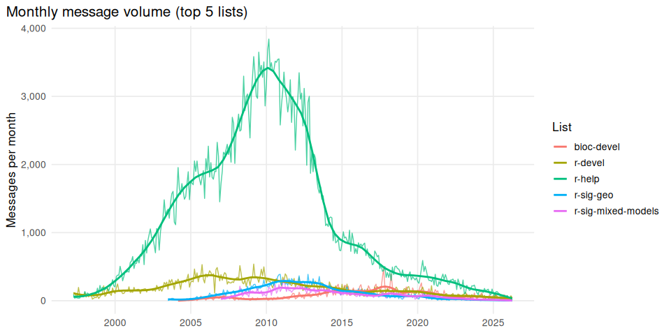
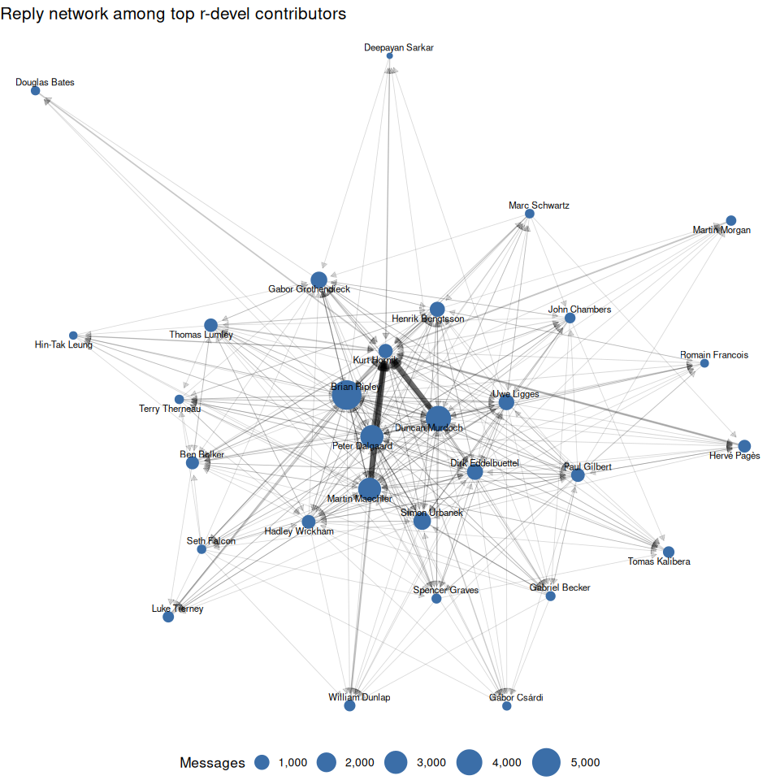

# R Mailing List Data: Demo Analysis


- [Setup](#setup)
- [Message volume over time](#message-volume-over-time)
- [Top posters by list](#top-posters-by-list)
- [Reply network on r-devel](#reply-network-on-r-devel)
- [Contributors across lists](#contributors-across-lists)

This notebook demonstrates how to work with the R mailing list Parquet
data. See the [main README](../README.md) for setup instructions and
data dictionary.

## Setup

### Using convenience functions

Source the helper script to download and cache data automatically — no
cloning required:

``` r
source("https://raw.githubusercontent.com/r-mailing-lists/data/main/scripts/rml.R")
```

``` r
library(dplyr, warn.conflicts = FALSE)
library(scales)
library(ggplot2)

theme_set(
  theme_minimal(base_size = 13) +
    theme(
      panel.grid.minor = element_blank(),
      plot.title.position = "plot"
    )
)

# Load aliases for name resolution
resolve_aliases <- function(df) {
  aliases_file <- "../aliases.json"
  if (!file.exists(aliases_file)) return(df)
  alias_data <- jsonlite::fromJSON(aliases_file)
  lookup <- data.frame(
    from_email_hash = unlist(alias_data$aliases$email_hashes),
    canonical_name = rep(alias_data$aliases$canonical_name,
                         lengths(alias_data$aliases$email_hashes)),
    stringsAsFactors = FALSE
  )
  df |>
    left_join(lookup, by = "from_email_hash") |>
    mutate(from_name = ifelse(is.na(canonical_name), from_name, canonical_name)) |>
    select(-canonical_name)
}
```

The helper provides four main functions:

``` r
# See all available mailing lists
rml_available()
```

     [1] "bioc-devel"           "r-announce"           "r-devel"             
     [4] "r-help"               "r-help-es"            "r-package-devel"     
     [7] "r-packages"           "r-sig-db"             "r-sig-dcm"           
    [10] "r-sig-debian"         "r-sig-dynamic-models" "r-sig-ecology"       
    [13] "r-sig-epi"            "r-sig-fedora"         "r-sig-finance"       
    [16] "r-sig-genetics"       "r-sig-geo"            "r-sig-gr"            
    [19] "r-sig-gui"            "r-sig-hpc"            "r-sig-insurance"     
    [22] "r-sig-jobs"           "r-sig-mac"            "r-sig-meta-analysis" 
    [25] "r-sig-mixed-models"   "r-sig-networks"       "r-sig-robust"        
    [28] "r-sig-teaching"       "r-sig-windows"        "r-ug-ottawa"         
    [31] "rcpp-devel"          

``` r
# Read a single list (use col_select to skip the body — much faster)
r_devel <- rml_read("r-devel",
  col_select = c("from_name", "date", "subject", "thread_id", "month"))

str(r_devel)
```

    Classes 'tbl' and 'data.frame': 63505 obs. of  5 variables:
     $ from_name: chr  "jeremiah.cohen at gmail.com" "Walke, Rainer" "Walke, Rainer" "Walke, Rainer" ...
     $ date     : POSIXct, format: "2009-07-23 19:30:12" "2004-08-16 13:41:57" ...
     $ subject  : chr  "Bug in seq() (PR#13849)" "(PR#7163) Install packages does not work on Win2003 serv er" "(PR#7163) Install packages does not work on Win2003 serv er" "(PR#7163) Install packages does not work on Win2003 serv er" ...
     $ thread_id: chr  "thread-5a699fb78c69" "thread-cf4236f01974" "thread-c40e96ef7024" "thread-e2aa0135326a" ...
     $ month    : chr  "2009-07" "2004-08" "2004-08" "2004-08" ...

``` r
# Thread-level summaries across all lists
threads <- rml_read_threads(col_select = c("list", "message_count"))
head(threads)
```

    # A data frame: 6 × 2
      list       message_count
    * <chr>              <int>
    1 bioc-devel             3
    2 bioc-devel             7
    3 bioc-devel             1
    4 bioc-devel             1
    5 bioc-devel             1
    6 bioc-devel             2

``` r
# Contributor statistics across all lists
contribs <- rml_read_contributors()
head(contribs)
```

    # A data frame: 6 × 7
      name     message_count list_count lists list_counts first_message last_message
    * <chr>            <int>      <int> <chr> <chr>       <chr>         <chr>       
    1 Brian R…         17941         10 r-he… r-help:117… 1998-06-04T1… 2026-03-16T…
    2 Duncan …         12560         13 r-he… r-help:732… 2000-02-16T2… 2026-04-18T…
    3 David W…         11661         12 r-he… r-help:110… 2003-03-07T1… 2025-11-09T…
    4 Peter D…         10798         10 r-he… r-help:706… 1997-04-01T0… 2026-04-08T…
    5 Gabor G…          9933         13 r-he… r-help:804… 2002-01-12T1… 2025-12-20T…
    6 Uwe Lig…          8399         13 r-he… r-help:656… 2000-03-07T1… 2026-03-10T…

### Working directly with Parquet files

If you have a local clone, read Parquet files directly with
[`nanoparquet`](https://cran.r-project.org/package=nanoparquet):

``` r
library(nanoparquet)

# Single list
r_devel <- read_parquet("data/messages/r-devel.parquet")

# All lists
files <- list.files("data/messages", pattern = "\\.parquet$", full.names = TRUE)
all_msgs <- do.call(rbind, lapply(files, read_parquet,
  col_select = c("list", "from_name", "date", "subject", "month")))

# Threads and contributors
threads <- read_parquet("data/threads.parquet")
contribs <- read_parquet("data/contributors.parquet")
```

## Message volume over time

``` r
# Read all lists into one data frame
all_msgs <- do.call(rbind, lapply(rml_available(), function(l) {
  rml_read(l, col_select = c("list", "from_name", "date", "month"))
}))

monthly <- all_msgs |>
  filter(date >= as.POSIXct("1997-01-01", tz = "UTC")) |>
  count(list, month) |>
  mutate(date = as.Date(paste0(month, "-01")))

top_lists <- monthly |>
  group_by(list) |>
  summarise(total = sum(n)) |>
  slice_max(total, n = 5) |>
  pull(list)

monthly |>
  filter(list %in% top_lists) |>
  ggplot(aes(date, n, color = list)) +
  geom_line(alpha = 0.7, linewidth = 0.5) +
  geom_smooth(se = FALSE, linewidth = 1, span = 0.15) +
  scale_y_continuous(labels = label_comma()) +
  scale_x_date(date_breaks = "5 years", date_labels = "%Y") +
  labs(
    title = "Monthly message volume (top 5 lists)",
    x = NULL, y = "Messages per month", color = "List"
  )
```

<div id="fig-timeline">



Figure 1

</div>

## Top posters by list

``` r
r_devel <- rml_read("r-devel",
  col_select = c("from_name", "from_email_hash", "date", "subject")) |>
  resolve_aliases()

recent <- r_devel[r_devel$date >= as.POSIXct(Sys.Date() - 365), ]
head(sort(table(recent$from_name), decreasing = TRUE), 10)
```


                       Martin Maechler                  Dirk Eddelbuettel 
                                    38                                 34 
                           Ivan Krylov                     Duncan Murdoch 
                                    29                                 25 
    iuke-tier@ey m@iii@g oii uiow@@edu                        Kurt Hornik 
                                    20                                 18 
                       Michael Chirico                       Mikael Jagan 
                                    17                                 16 
                         Simon Urbanek                     Peter Dalgaard 
                                    16                                 15 

## Reply network on r-devel

The `in_reply_to` field links each message to its parent, making it
straightforward to build a “who replies to whom” network.

``` r
library(igraph)
library(ggraph)

r_devel <- rml_read("r-devel",
  col_select = c("message_id", "from_name", "from_email_hash", "in_reply_to")) |>
  resolve_aliases()

# Build edges: replier -> original author
author_lookup <- r_devel |> select(message_id, from_name)

edges <- r_devel |>
  filter(!is.na(in_reply_to)) |>
  inner_join(author_lookup, by = c("in_reply_to" = "message_id"), suffix = c("_from", "_to")) |>
  filter(from_name_from != from_name_to) |>
  count(from = from_name_from, to = from_name_to, name = "replies")

# Keep only the most active participants
top_authors <- r_devel |>
  count(from_name, sort = TRUE) |>
  head(30) |>
  pull(from_name)

edges_top <- edges |>
  filter(from %in% top_authors, to %in% top_authors, replies >= 5)

g <- graph_from_data_frame(edges_top, directed = TRUE)

# Size nodes by total messages
msg_counts <- r_devel |>
  filter(from_name %in% V(g)$name) |>
  count(from_name)
V(g)$messages <- msg_counts$n[match(V(g)$name, msg_counts$from_name)]

ggraph(g, layout = "fr") +
  geom_edge_link(
    aes(width = replies, alpha = replies),
    arrow = arrow(length = unit(2, "mm"), type = "closed"),
    end_cap = circle(4, "mm")
  ) +
  geom_node_point(aes(size = messages), color = "#3B6EA8") +
  geom_node_text(aes(label = name), repel = TRUE, size = 3, max.overlaps = 20) +
  scale_edge_width(range = c(0.3, 2.5), guide = "none") +
  scale_edge_alpha(range = c(0.15, 0.6), guide = "none") +
  scale_size_continuous(range = c(2, 12), labels = label_comma(), name = "Messages") +
  labs(title = "Reply network among top r-devel contributors") +
  theme_void(base_size = 13) +
  theme(plot.title.position = "plot", legend.position = "bottom")
```

<div id="fig-reply-network">



Figure 2

</div>

## Contributors across lists

``` r
contribs <- rml_read_contributors()
contribs |>
  arrange(desc(message_count)) |>
  head(20) |>
  select(name, message_count, list_count) |>
  knitr::kable()
```

| name               | message_count | list_count |
|:-------------------|--------------:|-----------:|
| Brian Ripley       |         17941 |         10 |
| Duncan Murdoch     |         12560 |         13 |
| David Winsemius    |         11661 |         12 |
| Peter Dalgaard     |         10798 |         10 |
| Gabor Grothendieck |          9933 |         13 |
| Uwe Ligges         |          8399 |         13 |
| Dirk Eddelbuettel  |          7698 |         15 |
| Bert Gunter        |          6041 |          9 |
| Ben Bolker         |          6029 |          8 |
| Martin Maechler    |          5767 |         19 |
| jim holtman        |          4422 |          4 |
| Jeff Newmiller     |          4358 |          7 |
| Simon Urbanek      |          4293 |         11 |
| Roger Bivand       |          4271 |         12 |
| Jim Lemon          |          3886 |          6 |
| Thomas Lumley      |          3792 |          8 |
| Marc Schwartz      |          3765 |          9 |
| PIKAL Petr         |          3658 |          3 |
| Douglas Bates      |          3466 |         11 |
| Spencer Graves     |          3378 |         11 |
